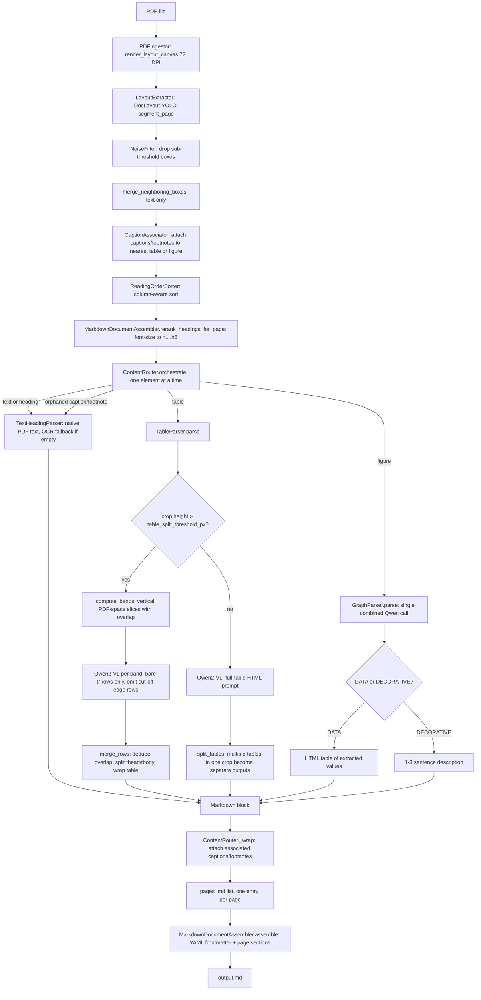
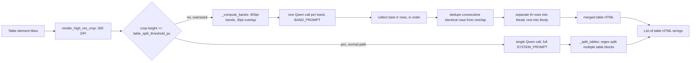
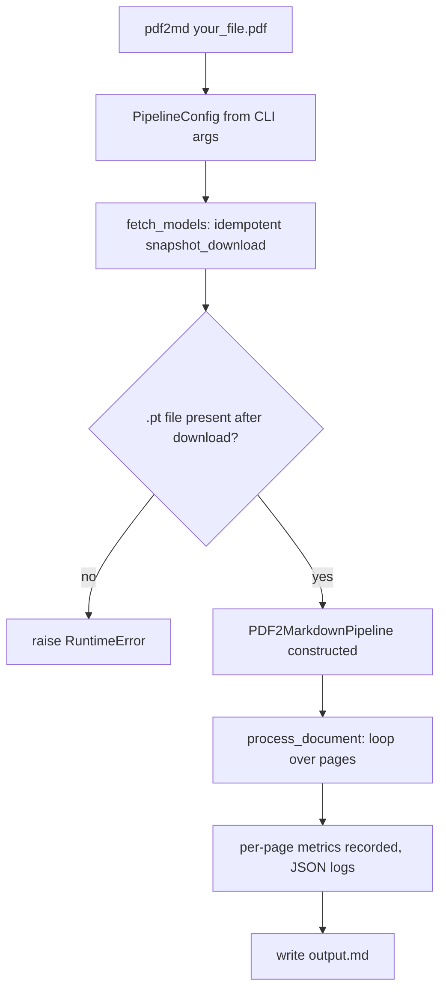
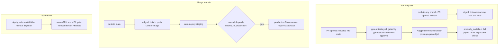
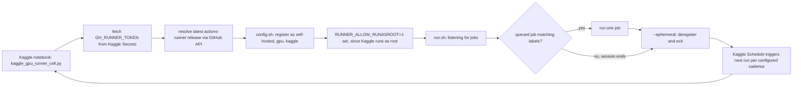

# pdf2md — System Flowchart

Mermaid diagrams render natively on GitHub — no extra tooling needed to view this file in the repo.

## 1. End-to-end pipeline (per document)

## 2. Table parser decision detail

## 3. CLI manual-test flow

## 4. CI/CD trigger map

## 5. Kaggle GPU runner lifecycle

